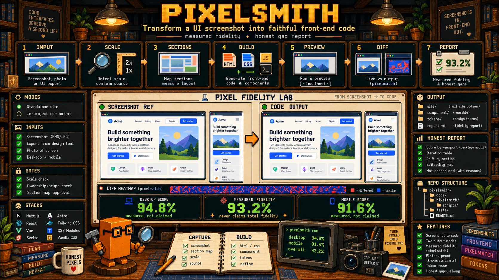

<div align="center">

[🇧🇷 Português](README.md) · **🇺🇸 English**



# pixelsmith

**Turns a UI screenshot into faithful front-end code — with measured fidelity and an honest gap report.**

Send an image of a UI (screenshot, design-tool export, photo of a screen) and get either a **static site** (HTML + vanilla CSS) served locally, or a **component written inside your project** (Next, Vite+React, Vue, Svelte, Astro, Nuxt; Tailwind, CSS Modules or vanilla) — both with a **perceptual fidelity score** + the honest list of what could _not_ be reproduced. Third sibling of the family: [mirrorsmith](https://github.com/eduardodotai/mirrorsmith) starts from a live URL, [figsmith](https://github.com/eduardodotai/figsmith) from a Figma file, **pixelsmith** from a pixel.

[](./LICENSE)
[](https://docs.claude.com/en/docs/claude-code/skills)
[](https://github.com/anthropics/claude-code/blob/main/docs/mcp.md)
[](https://nodejs.org)
[](#-architecture)

</div>

---

## ⚡ What it does

You have an interface that only exists as an **image** — a reference screenshot, an export of a lost design, a photo of a client's screen — and you need it **working as code**, not as a picture. Send:

```
implement this screenshot as a site          (image attached)
turn this screenshot into a component here in the project
```

And you get code served locally (or a component in your project's idiom), with a number telling you how faithful it is:

> _"2880×3200 print — suggested scale 2x, you confirmed; reference normalized to 1440×1600. Section map measured with a 1px profile: header 0/80, hero 80/520, cards 600/640, footer 1240/360; 8 colors by pixel sampling; 1 asset cropped from the original file. Built `site/` with tokens, sections annotated with their measurements, and the asset. Measured fidelity: **100.00%** in 1 iteration — a degenerate case (flat fixture, no text), so the number measures the pipeline, not the design. Not exercised: font specimen, JPEG noise, mobile."_

It is not "AI guessing a layout". It is **read the print by measuring → build → validate with a diff → honest report**. It never rounds the score and never claims total fidelity.

## 🎭 Two modes

| Mode | When | Output |
|------|------|--------|
| **standalone** | No project, or you want an isolated site/section | `site/` — `index.html` + `css/tokens.css` + `css/sections.css` (measurements in comments) + `assets/`; no build, no CDN, no motion |
| **in-project** | The cwd has a recognized framework and you ask for "in the project / this component" | Component in the project's idiom (TSX, SFC, `.astro`, `.svelte`), **project tokens first**, a temporary `pixelsmith-harness` route to measure, removed at the end |

Unsupported framework → falls back to standalone with a warning and hands over the CSS as a porting reference.

## 🎯 Why it's worth it

Turning a screenshot into code usually lands on one of two extremes:

❌ **Generic "screenshot to code"** — spits out eyeballed Tailwind, guessed colors, no measurements; nobody knows how far off it is  
❌ **Rebuilding by eye** — every height, gutter and hex becomes interpretation, and it "looks the same" until you overlay it

**This is different** — the edge is **measuring instead of looking + measured honesty**:

- 📏 **Everything is measured, nothing is estimated** — retina scale detected and confirmed; section boundaries from a luminance profile at **1 px per band**; x-axis boxes verified by crop + palette (shrink 1px → monochrome; expand 2px → the background shows up); colors by pixel sampling, never from memory
- ✂️ **Assets come from the print itself** — photos, illustrations and logos are **cropped from the original file** (full resolution); gradients, shadows and simple icons are reproduced in CSS; no AI image generation
- 📊 **Fidelity is a number, not a claim** — screenshot of the result vs. the @1x reference, perceptual diff (`pixelmatch`) → **% per viewport** + heatmap; non-overlapping area counts as full mismatch
- 📉 **Drift-first loop** — `band-diff` finds the y band where the divergence *starts*; fix the cause, re-measure; stop at ≥90% or an objective plateau (3 iterations <0.5%)
- 🧩 **Project tokens first** (in-project) — every print color looks for an existing token (ΔRGB ≤ 24) before a new one is created; and since the diff cannot see deltas that small, every substitution goes into a **table of diff-invisible deviations** in the report
- 🔊 **Never silent** — invalid flag, factor larger than the image, `sips` that does not convert, nonexistent directory: everything fails loudly with a clear message and exit 1

## 🛠 How it works (the pipeline)

```
print ──► 0 Intake ──► 1 Read the print ──► 2 Build ──► 3 Validate ──► 4 Report
           scale         measured map         standalone   diff % per     fidelity +
           origin        colors/assets        or in-proj   viewport       honest gaps
```

| # | Phase | What it does | Tool |
|---|-------|--------------|------|
| 0 | **Intake** | Dimensions + suggested scale (you confirm); crop browser chrome/status bar; mode; **origin gate** | `inspect-image` · `normalize-image` |
| 1 | **Read the print** | Section map with measurements (band profile + crops), sampled colors, font by glyph specimen, asset inventory, verbatim copy. **You confirm the map** before building | `inspect-image` · `crop-region` |
| 2 | **Build** | standalone: `site/` with tokens and annotated sections · in-project: `detect-stack` → project tokens → component in the project's idiom → harness route | `detect-stack` · playbooks |
| 3 | **Validate** | Screenshot at the exact width (`scrollWidth`/dpr preflight), diff vs. the @1x reference, drift-first until ≥90% or plateau; harness removed | `serve` · `screenshot-diff` · `band-diff` |
| 4 | **Report** | Score per viewport, iterations, drift per section, **diff-invisible color deviations**, editability map, files touched, **"Not reproduced"** | — |

## 📊 Proof — end-to-end smokes

The skill was exercised for real, by the installed skill itself, on a **synthetic fixture with known ground truth** (1440×1600 drawn by script, @1x and @2x, with a `ground-truth.json` of boxes and colors):

| Smoke | Result |
|-------|--------|
| **standalone** (@2x print) | Scale 2 detected; the blind-inferred map matched ground truth on 8/8 colors, 4/4 sections, 8/8 boxes, 1/1 asset (±0px); **100.00%** in 1 iteration, screenshot byte-identical to the reference; negative control: 98.61% with a 4px shift, 3.75% with the wrong image |
| **in-project** (worktree of a Next 16 app-router + TS + vanilla CSS project) | `detect-stack` → `next/app`; 4 project tokens reused (Δ0–24) + 4 new ones declared; TSX component; harness created, measured and removed; **100.00%** in 1 iteration |

The fixture is flat and has no text: **100% here measures the capture-and-diff pipeline, not the design.** Anything below 95% on it means a capture bug. On a real print with typography, photos and JPEG, the score drops and the gaps show up in the report — that is what the report is for. Every trap from those smokes became an operational instruction in the playbooks (16 findings folded in).

## 🧱 Architecture

Single skill (same spine for both modes; only the Build phase branches). **Pure, tested** scripts (`node --test` → 52/52) over a `lib/png.mjs` core (pngjs) — zero native dependencies.

```
pixelsmith/               SKILL.md (phases 0-4 spine) + scripts/ + references/
tests/                    make-fixture.mjs + fixtures/synthetic/ (known ground truth)
docs/                     spec and plan (spec → plan → TDD → per-task review → final review)
```

| Script | Role |
|--------|------|
| `lib/png.mjs` | read/write PNG (creates dirs), crop, box downscale, palette (5-bit, real bucket mean), per-band luminance profile |
| `lib/cli.mjs` | symlink-robust CLI guard, flags, `getNumber` (never silent NaN), `parseBox`, `fail` |
| `inspect-image.mjs` | dimensions, **suggested scale** (device-width table + heuristic), dominant palette, band profile (down to 1 px) |
| `normalize-image.mjs` | JPG/HEIC/WebP → PNG via `sips` (macOS), chrome crop, @2x/@3x → @1x downscale |
| `crop-region.mjs` | exact asset crop from the original file |
| `band-diff.mjs` | mismatch per y band + `firstDriftBand` — the engine of the drift-first loop |
| `detect-stack.mjs` | framework, router, TS, styling, component dirs (incl. `componentes/`), token files, package manager, dev command — fs reads only |
| `serve.mjs` · `screenshot-diff.mjs` | Local server + perceptual diff with an honest dimension penalty _(vendored from figsmith ← mirrorsmith)_ |

| Playbook | Covers |
|----------|--------|
| `read-the-print-playbook` | Scale and crops, section map from the 1 px profile, x axis by crop + palette, sampled colors, font by glyph, crop vs. reproduce, verbatim copy |
| `recreate-playbook` | `site/` structure, layout without fixed heights on content, assets, fit-zoom between two prints |
| `in-project-playbook` | Stack, project tokens first, component idiom, per-framework harness (with `role="region"`), middleware, cleanup |
| `validate-playbook` | Capture preflight (`emulate`, `scrollWidth`, dpr, `next dev` overlay), @1x diff, drift-first, plateau, print noise, report |

## 🚀 Installation

```bash
git clone https://github.com/eduardodotai/pixelsmith.git
cd pixelsmith
bash pixelsmith/scripts/install.sh    # npm install + symlink → ~/.claude/skills/pixelsmith
```

Restart Claude Code. Done — attach a screenshot and say `implement this screenshot`.

> The install uses a **symlink**, so the clone must stay where it is (update = `git pull`, no reinstall). Alternative target: `bash pixelsmith/scripts/install.sh /custom/path`. The tests (`tests/`) live in the repo, not in the symlink.

## 📋 Requirements

- [Claude Code](https://claude.ai/code) CLI or IDE extension
- [Chrome DevTools MCP](https://github.com/anthropics/claude-code/blob/main/docs/mcp.md) — **required** (validation screenshots)
- **Node ≥ 20** and **npm** (ESM scripts; tests via `node --test`)
- **macOS** to convert JPG/HEIC/WebP automatically (`sips`); on other systems, convert to PNG first

## 🎮 Usage

```bash
# Static site from a screenshot (attach the image)
implement this screenshot as a site

# Component inside the current project (Next, Vite+React, Vue, Svelte, Astro, Nuxt)
turn this screenshot into a component here in the project

# Two prints (desktop + mobile) → fit-zoom between the widths
screenshot to code: desktop + mobile
```

**Gates with you:** print scale (retina?) · origin (yours/client → faithful reproduction; third-party → layout base only, no logos, photos or copy) · confirmation of the measured section map.

**Auto-triggers** on: _"screenshot to code"_, _"implement this screenshot"_, _"turn this image into code/site/component"_, _"make it like this screenshot"_, or a UI image attached with intent to build.

**Boundaries** (what it is _not_): clone a live site → [mirrorsmith](https://github.com/eduardodotai/mirrorsmith) · read Figma → [figsmith](https://github.com/eduardodotai/figsmith) · tokens only → [site-identity-snapshot](https://github.com/eduardodotai/site-identity-snapshot) · video, AI image generation, motion → out of scope (declared).

## 🔬 How fidelity is measured

1. **Reference**: the print normalized to **@1x** (`normalize-image --scale S`, chrome crop before the downscale) — every measurement in the pipeline is in @1x px.
2. **Capture**: viewport at the exact width via `emulate` (dpr 1), `scrollWidth`/`devicePixelRatio` preflight, `next dev` overlay removed; full-page for standalone, the harness `div` for in-project.
3. **Perceptual diff** with `pixelmatch` → `%` per viewport + heatmap; non-overlapping area counts as full mismatch (**honest dimension penalty**).
4. **Drift-first loop**: `band-diff` points at the band where the deviation *starts*; fix the cause, not the symptom. Stop at **≥90%** or plateau (3 iterations <0.5%).
5. **What the diff cannot see is declared**: threshold 0.1 is blind to small color deltas — token substitutions and roundings go into their own table in the report, with ΔRGB and area.
6. **Honesty rule (hard):** never round, never claim total fidelity; a 100% only appears with the explanation of the degenerate case and the list of what was not exercised.

## 🧪 What it reproduces vs. reports as a gap

**Reproduces by measuring:** structure and order from measured boundaries, columns and boxes verified by crop, sampled colors, verbatim copy with emphasis, assets cropped from the original, project tokens reused (in-project).

**Reports as an honest gap:** unidentified fonts (substitute chosen by glyph evidence, gap declared), JPEG artifacts and font antialiasing, dynamic content (clock, badge, avatar), photos of screens with blur/moiré (indicative score), assets with context edges, third-party prints in layout-base mode (the score measures layout, not content).

## ⚖️ Ethics & license

Use it only with prints you have the right to implement. The skill has an **origin gate** in Phase 0: your own or client material is reproduced faithfully; a third-party reference becomes a **layout base** — structure and spacing yes, logos, photos and copy replaced by neutral placeholders and declared in the report. Without an origin confirmation, it does not build. Code under [MIT](./LICENSE); fixtures are synthetic, no client material.

## 🗺 Status & roadmap

- ✅ Complete pipeline (phases 0-4), two modes — **7 scripts, 52/52 tests**, zero native dependencies
- ✅ **Real smokes by the installed skill** — standalone and in-project (Next 16) at 100.00% on the synthetic fixture, with a negative control
- ✅ **16 smoke findings** folded into the playbooks (scale, routable harness prefix, accessible harness, capture preflight, diff-invisible color deviations)
- ✅ Final review + `skill-forge-review` 96/100
- 🔭 Next: **first real print** with typography and photos (font specimen, JPEG, mobile) · `compatibility` in the frontmatter · "MCP unavailable" gate · `inspect-image --axis x` · Codex port (via `skill-forge-convert`)

## 🔗 Related skills

- 🪞 [**mirrorsmith**](https://github.com/eduardodotai/mirrorsmith) — mirrors/recreates **live sites** from a URL, with the same measured-fidelity philosophy
- 🎨 [**figsmith**](https://github.com/eduardodotai/figsmith) — recreates from the **Figma file**; pixelsmith vendors its `serve` and `screenshot-diff`
- 🎨 [**site-identity-snapshot**](https://github.com/eduardodotai/site-identity-snapshot) — captures a site's visual identity (tokens, guide, assets)
- 🧩 [**patterns-audit**](https://github.com/eduardodotai/patterns-audit) — multi-agent audit of SOLID/DRY/GoF/code smells

---

<div align="center">

_Built with discipline: spec → plan → TDD → per-task review → real smokes → final review._ · **Measure, don't eyeball. Report honestly.**

</div>
